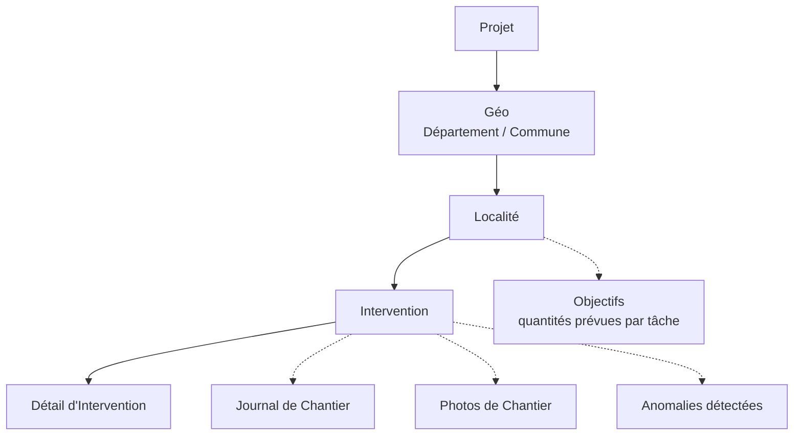
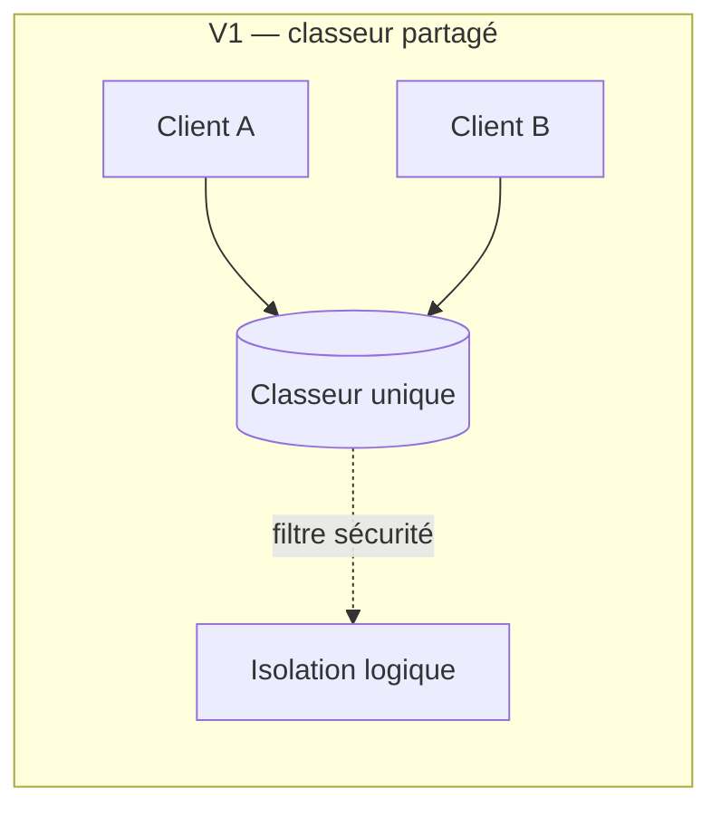
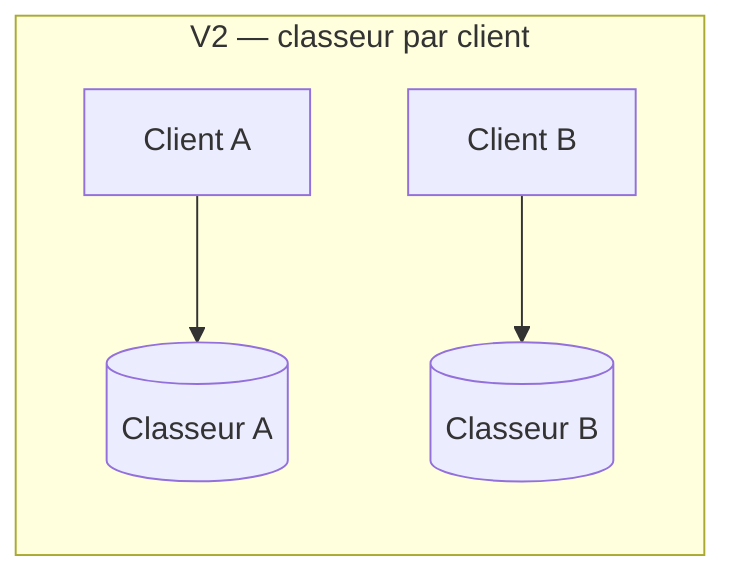

# Architecture — ElecTrack Pro

## 1. Vue d'ensemble

ElecTrack Pro est conçu comme un **produit**, pas comme un projet ponctuel. La contrainte structurante de toute l'architecture est simple à énoncer et difficile à tenir dans la durée : **aucune valeur, aucun nom, aucun identifiant spécifique à un client ne doit apparaître en dur** dans le modèle de données, les formules AppSheet, ou les scripts d'automatisation. Tout ce qui varie d'un client à l'autre est piloté par configuration (table `Projets_Config`), jamais codé.

Trois couches :

```
┌─────────────────────────────────────────┐
│   AppSheet (front mobile + web)          │  ← saisie terrain, consultation, rôles
├─────────────────────────────────────────┤
│   Google Sheets (modèle de données)      │  ← ~24 tables, un classeur par client (v2)
├─────────────────────────────────────────┤
│   Google Apps Script (automatisation)    │  ← snapshots planifiés, alertes email, calculs
└─────────────────────────────────────────┘
```

## 2. Modèle de données — hiérarchie métier

La hiérarchie centrale reflète la réalité d'un chantier d'électrification, du plus général au plus granulaire :



Chaque **Localité** porte ses objectifs quantitatifs par type de tâche (table `Objectifs`), et chaque **Intervention/Détail** enregistre l'avancement réel constaté sur le terrain. Le rapprochement des deux — pondéré par l'importance relative de chaque tâche (`Parametres_Poids`) — produit l'indicateur central du produit : le **taux d'avancement pondéré** par localité.

### Tables de référence clés

| Table | Rôle |
|---|---|
| `Projets_Config` | Métadonnées projet : nom, client, seuils d'alerte, destinataires |
| `Utilisateurs` / `Utilisateurs_Projets` | Comptes et rattachement utilisateur ↔ projet (table de jointure, pas une liste à plat) |
| `Roles` | Miroir en lecture seule d'`Utilisateurs`, utilisé uniquement pour casser une boucle d'auto-référence dans les filtres de sécurité |
| `Geo_Config` | Référentiel géographique (départements, communes) |
| `Catalogue_Materiel` / `Categories_Taches` / `Type_Travaux` | Référentiels métier réutilisables d'un client à l'autre |
| `Parametres_Poids` | Source unique de vérité pour la pondération des tâches dans le calcul d'avancement |
| `Helper_Calcul` | Table de calcul intermédiaire, alimentée par un script planifié plutôt que par des formules volatiles |

## 3. Multi-tenant : la décision V1 → V2

**V1** (déploiement initial) : tous les clients dans un classeur logiquement partagé, isolation assurée uniquement par filtres de sécurité (`Actif=TRUE` + périmètre projet/zone sur chaque table). Fonctionnel, mais avec une limite structurelle identifiée à l'audit : certaines tables agrégées (`Recap_*`, pivots) ne peuvent pas garantir une étanchéité totale entre clients par simple filtre — le risque résiduel est architectural, pas applicatif.

**V2** (cible produit) : **un classeur Google Sheets dédié par client**. Ce choix élimine la classe de risque entière plutôt que de la mitiger — l'isolation devient une propriété de l'infrastructure, pas une règle qu'il faut vérifier table par table à chaque évolution.





## 4. Modèle de sécurité par rôle

Quatre rôles : **Super Admin**, **Admin**, **Chef de Mission**, **Superviseur** (restreint à sa zone d'affectation).

Principe appliqué systématiquement sur les ~20 tables sensibles : un filtre de sécurité qui combine trois conditions —

1. `Actif = TRUE` (compte non désactivé)
2. Rattachement projet valide (via `Utilisateurs_Projets`, jamais via une liste texte à parser)
3. Restriction de zone géographique pour les Superviseurs uniquement

Un piège structurel a été résolu ici : AppSheet ne permet pas à une table de référencer sa propre Security Filter (auto-référence circulaire) — la table `Utilisateurs` s'appuie donc sur `Roles`, un miroir en lecture seule alimenté par formule, qui joue le rôle de proxy.

## 5. Pipeline d'automatisation (Google Apps Script)

Plutôt que les Bots AppSheet natifs (limités en version gratuite — les emails partent uniquement au créateur de l'app), toute la logique d'alerte et de calcul planifié est portée par des scripts Apps Script déclenchés par trigger temporel :

| Script | Fréquence | Fonction |
|---|---|---|
| Snapshot de calcul d'avancement | 30 min | Fige les indicateurs d'avancement pondéré, alimente les tables de classement et de récapitulatif |
| Snapshot géographique | Hebdo + quotidien | Synchronise les référentiels géographiques |
| Alerte d'inactivité | Hebdo | Détecte les chantiers sans activité au-delà du seuil configuré par projet |
| Alerte d'anomalie | Quotidien (19h) | Signale les anomalies de tâches détectées |
| Gestion des rattachements utilisateur-projet | Quotidien (4h) | Détecte les rattachements orphelins (comptes désactivés encore liés à un projet) — signale, ne supprime jamais automatiquement |

Conventions transverses : verrouillage d'exécution (`LockService`) pour éviter les collisions entre déclencheurs, écriture en une seule passe (`setValues()` uniquement si changement réel), wrapper de réessai sur toutes les lectures Sheets, et aucune référence en dur au nom d'un client dans le code — la même règle que pour le modèle de données.

## 6. Ce que cette architecture rend possible

- Ajouter un nouveau client sans toucher au code : copier le classeur modèle, renseigner `Projets_Config`
- Faire évoluer les référentiels (matériel, catégories de tâches) sans casser les projets existants
- Garantir qu'un Superviseur ne voit jamais de données hors de sa zone, sans exception codée en dur
- Auditer et faire évoluer la logique de calcul d'avancement sans risquer de "zérofier" silencieusement l'historique (voir `lessons-learned.md`)
