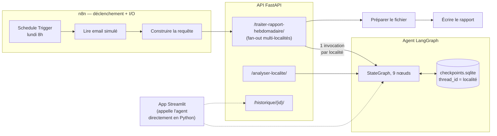
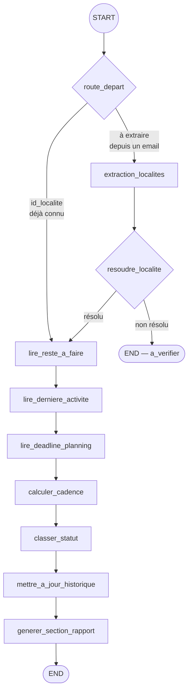

# ⚡ Agent de relance de chantier — démo n8n + LangGraph

[🇬🇧 English version](README.md)

Démonstration portfolio d'un agent d'automatisation dérivé d'un projet réel de suivi de
chantiers d'électrification (données, noms de localités et échéances fictifs — voir
[Confidentialité](#confidentialité) ci-dessous).

**[▶ Démo en ligne](https://energy-data-scientist-kbqch4dr9lgc3aypv3kmgx.streamlit.app/)** —
app Streamlit déployée sur Streamlit Community Cloud.

## Le cas d'usage

Un chef de chantier envoie chaque semaine un rapport listant les localités sans activité
depuis plus de 3 mois. L'agent, pour chacune :

1. extrait et identifie la localité (résolution de nom tolérante aux fautes de frappe, y compris en cas d'ambiguïté entre deux noms proches) ;
2. compare l'inactivité déclarée à l'inactivité mesurée dans le système de suivi terrain, et signale tout écart suspect ;
3. calcule la cadence d'exécution nécessaire pour tenir les échéances de planning restantes ;
4. classe la localité (normal / retard / critique) en tenant compte de sa tendance sur les semaines précédentes, grâce à un historique persisté d'une semaine à l'autre ;
5. génère la section de rapport correspondante.

## Architecture

### Pipeline (n8n → API → agent)



### Graphe LangGraph (agent/)



`route_depart` (Jour 5) permet au même graphe de servir deux entrées : une localité déjà
connue (endpoint `/analyser-localite`, ou chaque étape du fan-out de
`/traiter-rapport-hebdomadaire`) saute directement à `lire_reste_a_faire` ; un email brut
repasse par le chemin historique (`extraction_localites` → `resoudre_localite`).

### Dossiers

- **`agent/`** — le graphe LangGraph : extraction, résolution de nom (fuzzy matching avec
  marge d'ambiguïté), lecture des données terrain, calcul de cadence, classification,
  historique persisté (`agent/checkpoints.sqlite`, versionné).
- **`api/`** — API FastAPI exposant l'agent en HTTP (voir `api/main.py` pour le détail des
  3 endpoints).
- **`app/`** — app Streamlit à 3 pages (Accueil, Simulateur de relance, Historique de
  cadence). Appelle l'agent directement en Python plutôt que via l'API — voir
  `app/agent_client.py` pour le pourquoi.
- **`n8n/`** — workflow n8n (`workflow.json`) qui orchestre le déclenchement hebdomadaire ;
  voir `n8n/README.md` pour les points d'attention (accès fichier, validation).
- **`data/`** — jeu de données synthétique (55 localités, 4 départements du Bénin, 11
  tâches de travaux HTA/BT).
- **`tests/`** — suite pytest (agent, API, app Streamlit).
- **`docker-compose.yml`** — lance l'API et n8n ensemble en local.

## Exécuter en local

```bash
python -m venv .venv && source .venv/bin/activate
pip install -r requirements.txt
pytest tests/ -q          # 41 tests

# API
uvicorn api.main:app --reload --port 8000

# App Streamlit (dans un autre terminal)
streamlit run app/Accueil.py

# Stack complète API + n8n (nécessite Docker — voir n8n/README.md pour le détail)
docker compose up --build
```

## Déploiement (Streamlit Community Cloud)

L'app est déployée et fonctionnelle : **https://energy-data-scientist-kbqch4dr9lgc3aypv3kmgx.streamlit.app/**

1. Pousser ce repo sur GitHub.
2. Sur [share.streamlit.io](https://share.streamlit.io), créer une nouvelle app pointant
   vers ce repo, avec **Main file path : `app/Accueil.py`**.
3. Les dépendances sont détectées automatiquement — voir le point d'attention ci-dessous
   si ce dépôt est lui-même un sous-dossier d'un monorepo.

L'app déployée fonctionne de façon autonome (elle appelle l'agent directement en Python,
pas via l'API — voir `app/agent_client.py`) : aucun autre service à déployer pour la démo
publique. L'API FastAPI et le workflow n8n restent démontrés indépendamment, en local
(`docker compose up`) ou via le GIF de démo (`n8n_demo.gif`).

### Point d'attention — emplacement de requirements.txt dans un monorepo

Community Cloud cherche un fichier de dépendances (1) dans le dossier de l'**entrypoint**
(ici `app/`, puisque Main file path = `app/Accueil.py`), puis (2) à la **racine du dépôt
GitHub** — jamais dans un dossier intermédiaire. Si ce projet est déployé tel quel (repo
dédié), `requirements.txt` à sa racine correspond à la racine du dépôt : pas de problème.
Si en revanche il est ajouté comme sous-dossier d'un monorepo existant (ex.
`Medcos/Energy-Data-Scientist/smart-jobsite-relaunch-agent/`), ni la racine du monorepo ni
le dossier `app/` ne contiennent naturellement ce fichier — Community Cloud retombe alors
sur le `requirements.txt` du monorepo (destiné à un *autre* projet), d'où un
`ModuleNotFoundError` sur `rapidfuzz`/`plotly` (absents de ce fichier-là). D'où
**`app/requirements.txt`**, une copie scopée placée dans le dossier de l'entrypoint —
trouvée en premier, quelle que soit la profondeur du sous-dossier. À maintenir en phase
avec `requirements.txt` (racine) si les versions changent.

### Point d'attention — reste à faire "actionnable"

Le jeu de données synthétique contient des couples tâche/localité où le cumulé réalisé
dépasse le prévu (sur-réalisation, ex. `TASK_Cable_BT` sur plusieurs localités), ce qui
donne un `reste_a_faire` négatif. `agent/nodes.reste_actionnable()` filtre ces valeurs
(reste > 0) avant tout affichage ou calcul de moyenne historique — c'est la seule
définition du "reste actionnable" dans tout le projet (rapport texte, page Historique,
classification de statut).

## Confidentialité

**Réel** : le pays (Bénin), les 4 départements, et les quantités de travaux agrégées par
tâche.

**Fictif** : noms de communes et de localités, coordonnées GPS, calendrier exact des
interventions, échéances précises de planning, nom du projet/client d'origine.

Toute donnée générée est vérifiée par un grep anti-fuite avant chaque livraison.

## Statut

Jours 1 à 6 du plan de mise en place terminés (données, agent, checkpointer + tests,
intégration n8n, API + app Streamlit, déploiement Streamlit Community Cloud validé en
conditions réelles, README + diagrammes). Reste : publication et carte portfolio (Jour 7).
