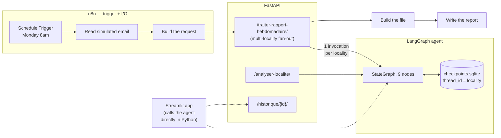
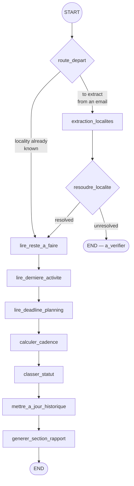

# ⚡ Jobsite Relaunch Agent — n8n + LangGraph Demo

[🇫🇷 Version française](README.fr.md)

`n8n` `LangGraph` `FastAPI` `Streamlit` `Python` `SqliteSaver`

📂 **Data Science & Predictive Analytics** — Project 3/3 · [Portfolio home](../README.md) · [← Predictive Rollout & Supply Forecast](../predictive-avancement-projet)

Portfolio demonstration of an automation agent derived from a real electrification-jobsite
tracking project (data, locality names, and deadlines are fictional — see
[Confidentiality](#confidentiality) below).

Built by Medico Diomande — Electromechanical Engineer (10 years field experience on World Bank / AFD / AfDB electrification projects) + Data Scientist. Third and most complex installment of the Data Science & Predictive Analytics track, following [Predictive Maintenance](../predictive-maintenance-electrical-grid) and [Predictive Rollout & Supply Forecast](../predictive-avancement-projet) — this project moves from predicting outcomes to automating the weekly operational decision itself.

**[▶ Live demo](https://energy-data-scientist-kbqch4dr9lgc3aypv3kmgx.streamlit.app/)** —
Streamlit app deployed on Streamlit Community Cloud.

## Business Impact

- → Automates a weekly manual cross-check — declared inactivity vs. inactivity measured in the field-tracking system — that previously depended on a supervisor's memory and a spreadsheet
- → Typo-tolerant locality name resolution with explicit ambiguity detection, instead of a silent wrong match between two similarly-named localities
- → Trend-aware status classification: week-over-week history is persisted, so a single noisy week doesn't flip a locality to "critical" if the underlying trend is fine
- → One LangGraph graph serves three entry points (n8n weekly trigger, single-locality API call, Streamlit simulator) — a single source of truth for the classification logic instead of three drifting implementations

## The use case

Every week, a site supervisor sends a report listing localities with no recorded activity
for more than 3 months. For each one, the agent:

1. extracts and identifies the locality (typo-tolerant name resolution, including
   detection of ambiguity between two similar names);
2. compares the declared inactivity against the inactivity measured in the field-tracking
   system, and flags any suspicious discrepancy;
3. computes the execution pace required to meet the remaining planning deadlines;
4. classifies the locality (normal / delayed / critical), taking its trend over previous
   weeks into account thanks to a history persisted from one week to the next;
5. generates the corresponding report section.

## Architecture

### Pipeline (n8n → API → agent)



### LangGraph graph (agent/)



`route_depart` lets the same graph serve two entry points: a locality that is
already known (the `/analyser-localite` endpoint, or each step of the
`/traiter-rapport-hebdomadaire` fan-out) jumps straight to `lire_reste_a_faire`; a raw
email still goes through the historical path (`extraction_localites` →
`resoudre_localite`).

### Folders

- **`agent/`** — the LangGraph graph: extraction, name resolution (fuzzy matching with an
  ambiguity margin), reading field data, pace calculation, classification, persisted
  history (`agent/checkpoints.sqlite`, versioned).
- **`api/`** — FastAPI exposing the agent over HTTP (see `api/main.py` for the 3
  endpoints).
- **`app/`** — 3-page Streamlit app (Home, Relaunch Simulator, Pace History). Calls the
  agent directly in Python rather than through the API — see `app/agent_client.py` for
  why.
- **`n8n/`** — n8n workflow (`workflow.json`) orchestrating the weekly trigger; see
  `n8n/README.md` for points of attention (file access, validation).
- **`data/`** — synthetic dataset (55 localities, 4 departments of Benin, 11 HV/LV work
  tasks).
- **`tests/`** — pytest suite (agent, API, Streamlit app).
- **`docker-compose.yml`** — runs the API and n8n together locally.

## Running locally

```bash
python -m venv .venv && source .venv/bin/activate
pip install -r requirements.txt
pytest tests/ -q          # 41 tests

# API
uvicorn api.main:app --reload --port 8000

# Streamlit app (in another terminal)
streamlit run app/Accueil.py

# Full API + n8n stack (requires Docker — see n8n/README.md for details)
docker compose up --build
```

## Deployment (Streamlit Community Cloud)

The app is deployed and working: **https://energy-data-scientist-kbqch4dr9lgc3aypv3kmgx.streamlit.app/**

1. Push this repo to GitHub.
2. On [share.streamlit.io](https://share.streamlit.io), create a new app pointing to this
   repo, with **Main file path: `app/Accueil.py`**.
3. Dependencies are detected automatically — see the point of attention below if this
   repo is itself a subfolder of a monorepo.

The deployed app works standalone (it calls the agent directly in Python, not through the
API — see `app/agent_client.py`): no other service needs to be deployed for the public
demo. The FastAPI API and the n8n workflow remain demonstrated independently, either
locally (`docker compose up`) or via the demo GIF (`n8n_demo.gif`).

### Point of attention — requirements.txt location in a monorepo

Community Cloud looks for a dependency file (1) in the **entrypoint's own directory**
(here `app/`, since Main file path = `app/Accueil.py`), then (2) at the **root of the
GitHub repo** — never in an intermediate folder. If this project is deployed as-is (its
own dedicated repo), the `requirements.txt` at its root IS the repo root: no problem. If
instead it is added as a subfolder of an existing monorepo (e.g.
`Medcos/Energy-Data-Scientist/smart-jobsite-relaunch-agent/`), neither the monorepo root
nor the `app/` folder naturally contains this file — Community Cloud then falls back to
the monorepo's own `requirements.txt` (meant for a *different* project), causing a
`ModuleNotFoundError` on `rapidfuzz`/`plotly` (absent from that file). Hence
**`app/requirements.txt`**, a scoped copy placed in the entrypoint's own folder — found
first, regardless of how deep the subfolder is. Keep it in sync with the root
`requirements.txt` if versions change.

### Point of attention — "actionable" remaining work

The synthetic dataset contains task/locality pairs where cumulative completed work
exceeds the planned quantity (over-delivery, e.g. `TASK_Cable_BT` in several localities),
producing a negative `reste_a_faire`. `agent/nodes.reste_actionnable()` filters these out
(reste > 0) before any display or historical-average computation — it is the single
definition of "actionable remaining work" used throughout the project (text report,
history page, status classification).

## Why My Background Matters

The design choices in this agent come directly from ten years running electrification
worksites, not from a generic automation tutorial. "No activity for 3 months" is a real
field-reporting threshold, not an arbitrary number. Locality-name ambiguity is a real
recurring problem when 55 field agents report on similarly-named localities by hand —
hence a fuzzy matcher with an explicit ambiguity margin rather than a naive best-match.
And a trend-aware classifier (weighing history, not just the latest week) reflects how an
experienced mission supervisor actually judges whether a stalled locality is a blip or a
genuine problem — the same judgment call this agent now makes automatically, every Monday.

## Confidentiality

**Real**: the country (Benin), the 4 departments, and the aggregated work quantities per
task.

**Fictional**: commune and locality names, GPS coordinates, exact intervention schedule,
precise planning deadlines, original project/client name.

All generated data is checked with a leak-detection grep before every delivery.

## What's Implemented

The full pipeline is built and validated end-to-end: the synthetic data layer, the
9-node LangGraph agent with persisted checkpointing (regression-tested), the n8n
weekly-trigger integration, the FastAPI backend, and the Streamlit app — including a
live Streamlit Community Cloud deployment, validated in real conditions rather than
just locally.

---

Author: Medico Diomande · dmedcos@yahoo.fr · linkedin.com/in/medico-diomande-data · Available for remote missions
